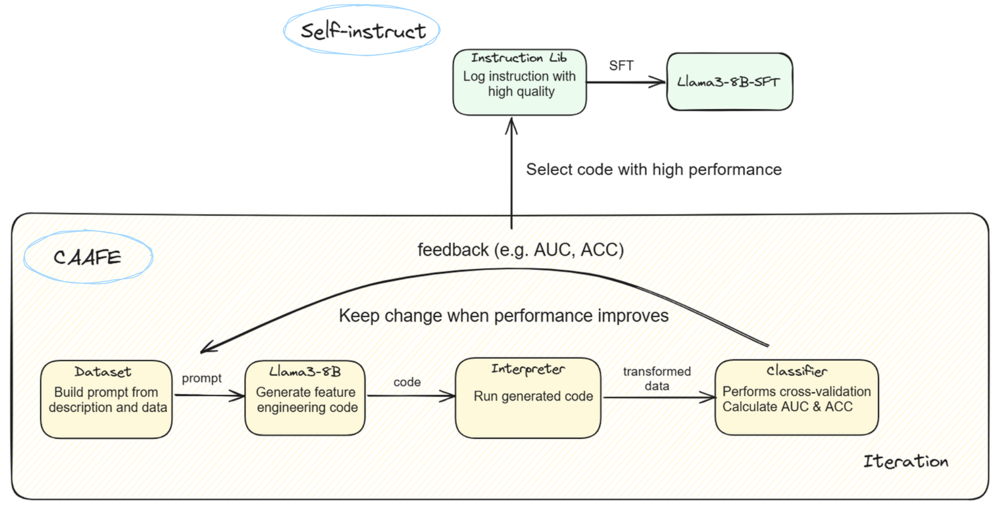

# Self-Instruct CAAFE

Self-Instruct CAAFE is an enhanced approach of CAAFE which combines its foundational principles with the innovative Self-Instruct method, achieving unprecedented automatic feature engineering performance.

This work is the course project of CS3308 Machine Learning, completed by Yanheng He, Jiahe Jin and Yuxuan Zhang together. All members actively participated in every phase, including discussions, coding, experimentation, and poster production, each making equally significant contributions.

### Usage

#### Enable vLLM Server

Run `./server.sh` or `./server-sft.sh`.

#### Data Generation 

Run `./run-main.sh true 1 1`.

#### Supervised Fine-Tuning

Run `./fineturn.sh` after configuring LLaMA-Factory.

#### Evaluation

Run `./evaluation.sh`.

### Project Structure

- `caafe/`: Code directory
- `data/`: Data directory
  - `data/eval_result.txt` and `data/eval_baseline.txt` contain detailed evaluation results
  - `data/finetuning_data.json` contains the data we used for fine-tuning
- `playground/*`: Demonstration code for invoking the LLM
- `evaluation.sh`: Evaluation script
- `finetune.sh`: Fine-tuning script
- `run-main.sh`: Data generation script
- `server.sh` & `server-sft.sh`: vllm scripts

### Process Diagram

### Evaluation Results

The mean AUC results of three different classifiers on 10 OpenML datasets, random seed = 42 & 24.

| Method        | No Feat. Eng. | Llama3-8B (Iter=3) | Llama3-8B (Iter=10) | Llama3-8B-SFT (Iter=3) | Llama3-8B-SFT (Iter=10) |
| ------------- | ------------- | ------------------ | ------------------- | ---------------------- | ----------------------- |
| TabPFN        | 0.8117        | 0.8189 ± 0.0059    | 0.8232 ± 0.0045     | 0.8447 ± 0.0055        | 0.8595 ± 0.0093         |
| Random Forest | 0.7836        | 0.8219 ± 0.0068    | 0.8167 ± 0.0115     | 0.8403 ± 0.0019        | 0.8561 ± 0.0038         |
| XGBoost       | 0.7790        | 0.7862 ± 0.0052    | 0.8136 ± 0.0109     | 0.8039 ± 0.0054        | 0.8221 ± 0.0093         |

### Acknowledgement

* We thank Muning Wen for valuable discussions on our work.
* We thank the Apex Lab for providing us computing resources.
* We thank the Meta Llama team for giving us access to their models, and open-source projects, including vLLM and LLaMA-Factory.
